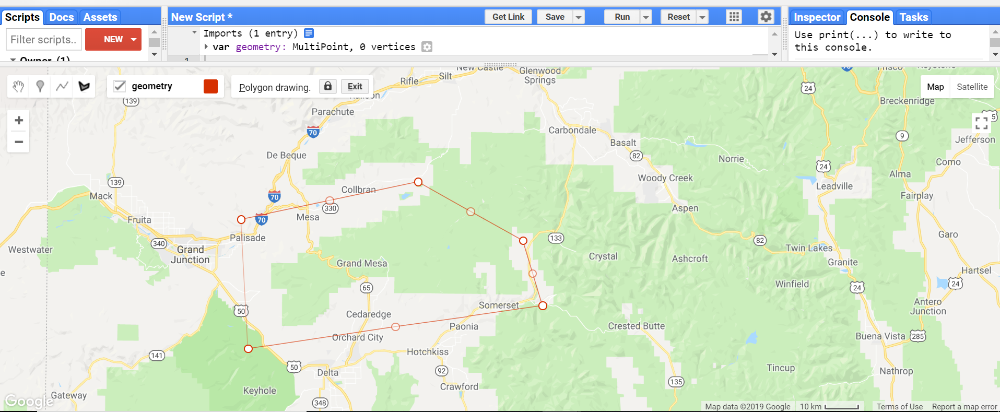
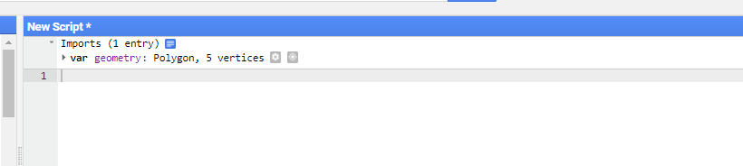
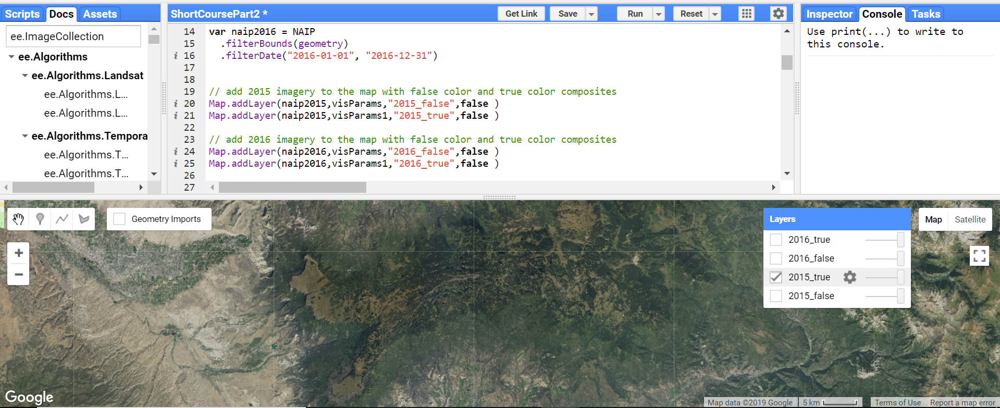
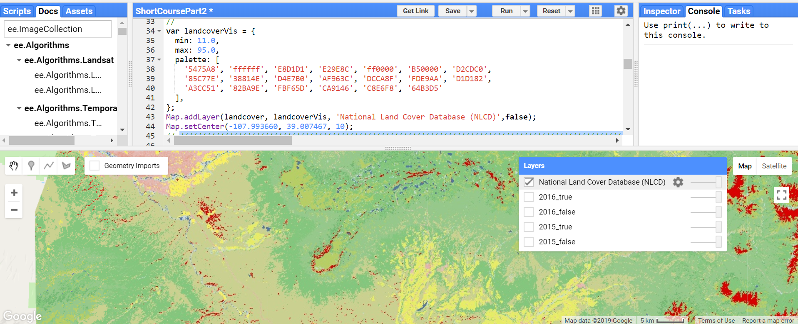
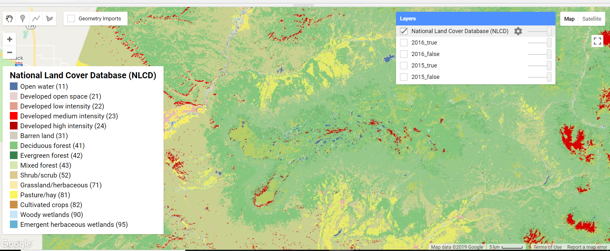
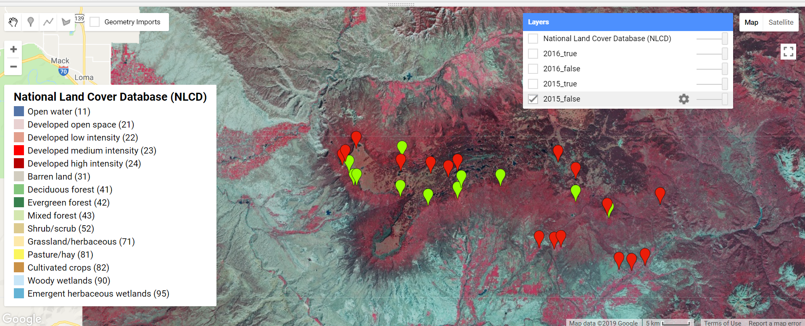
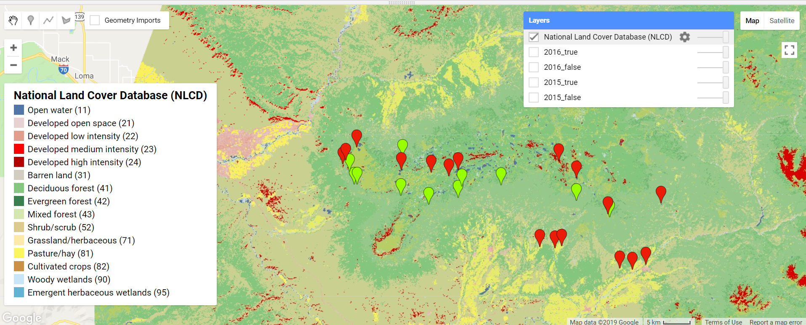
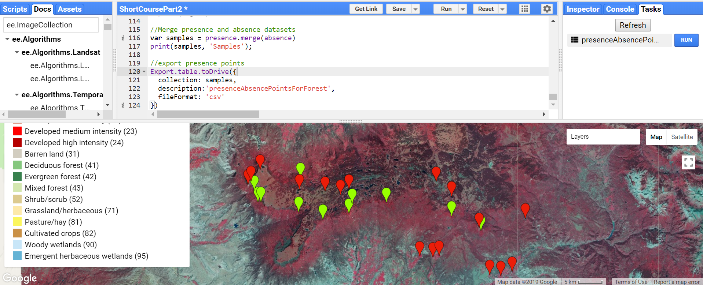
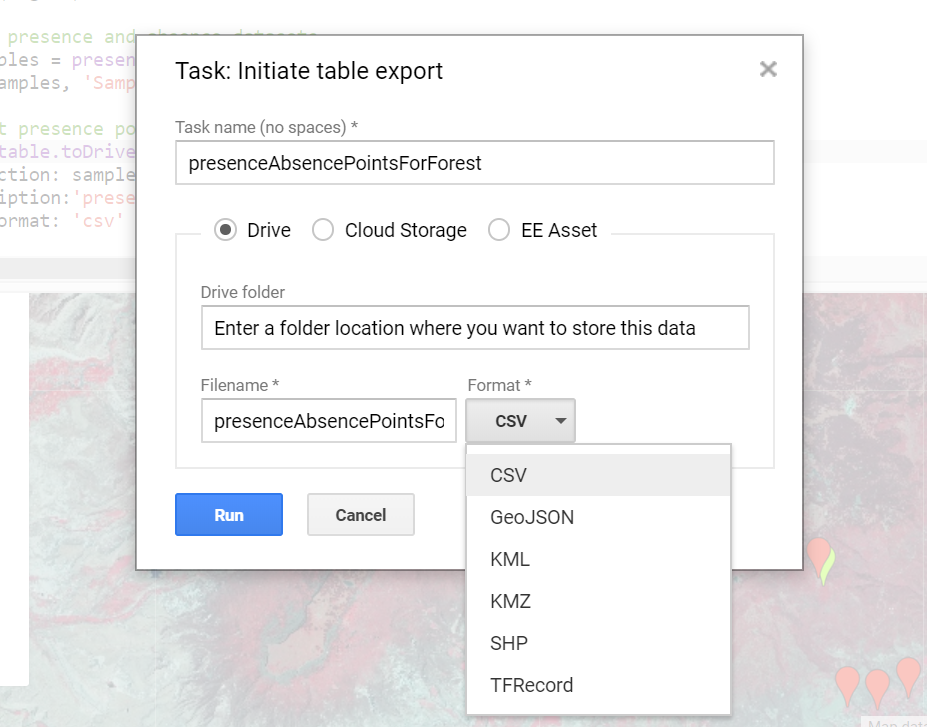

# Google Earth Engine

Google Earth Engine (GEE) eliminates the downloading, preprocessing, and heavy computational environment that is traditionally involved with using remotely sensed data. This web based analysis platform provides access to large libraries of geospatial data, typically in raster format, and a distributed computing environment on Google Servers, allowing you to rapidly move into asking your questions and developing testable methodologies. GEE does require registration via a google account. You can sign up and read more at this link: [sign up](https://earthengine.google.com/)

## Goal

In this document we will demonstrate how to visually sample land cover classes using high resolution aerial imagery from the National Agricultural Imagery Program (NAIP) and land cover data from the National Land Cover Database (NLCD). The output of this sampling effort will be a series of presence/absence data points that we will use to train our predictive model. 

## Background on datasets

**The National Land Cover Database** (NLCD) is a 30-m Landsat-based land cover database available at 4 time periods (1992, 2001, 2006 and 2011). 1992 data are primarily based on unsupervised classification of Landsat data. The rest of the images rely on an imperviousness data layer for urban classes and on a decision-tree classification for identification of the remaining classes. 

**The National Agriculture Imagery Program** (NAIP) acquires aerial imagery during the agricultural growing seasons in the continental US. NAIP projects are contracted each year based upon available funding and the FSA imagery acquisition cycle. Beginning in 2003, NAIP was acquired on a 5-year cycle. 2008 was a transition year, and a three-year cycle began in 2009. NAIP imagery is acquired at a one-meter ground sample distance (GSD) with a horizontal accuracy that matches within six meters of photo-identifiable ground control points, which are used during image inspection. Depending on the given location and time frame, NAIP imagery is collected in 4 bands: blue, green, red, and near infrared. The near infrared band is helpful in distinguishing between different types of vegetation.

## Setting up Sampling Interface
In this example we will sample Quaking Aspen (<i>Populus tremuloides</i>) in the Grand Mesa region of Colorado.
We will use both true and false color NAIP imagery to distinguish aspen stands from other land cover types. We will rely on the NLCD to quickly validate our sampling process. 

## Define Region of Interest
We will define the region interest by creating a geometry feature. This is as simple as selecting the geometry button (see figure below) and drawing a polygon that outlines your area of interest. Complete the feature by clicking on the initial point. 
<br>
<br>
<br>


<br>
<br>
<br>
Draw your polygon: click on the locations that you want to define as your region of interest
<br>
<br>


<br>
<br>
<br>
<br>
Complete the geometry feature by placing a point on the starting location, and a new feature will appear in your text editor called 'geometry'.
<br>
<br>

<br>
<br>
<br>
<br>

## Loading In NAIP Imagery

The code below allows you to call in the imagery and filter it for both 2015 and 2016. We include both years because it is not simple to determine when NAIP imagery is captured. For example, not all of Colorado was captured in 2015. 

```javascript
// call in NAIP imagery as an image collection
var NAIP = ee.ImageCollection("USDA/NAIP/DOQQ");

// filter the data based on date and area for 2015
var naip2015 = NAIP
  .filterBounds(geometry)
  .filterDate("2015-01-01", "2015-12-31");
// filter the data based on date and area for 2016
var naip2016 = NAIP
  .filterBounds(geometry)
  .filterDate("2016-01-01", "2016-12-31");

```  

## Adding images to the map

Now that we've loaded the imagery, we want to visualize it on the map. As NAIP is collected as a series of images, we need to create a multispectral image by defining which bands we want to use and visualize. We do this by setting visualization parameters and saving them as a variable. When we add the images to the map, we can call the visualization parameter variable to automatically adjust how we see the data.

In this case, we're going to add true color and false color composites for both 2015 and 2016. It's good to start with both because we don't really know when the imagery was captured for your area of interest.


```javascript

//define viewing parameters for multi band images
var visParamsFalse = {bands:['N', 'R', 'G']};
var visParamsTrue = {bands:['R', 'G', 'B']};

// add 2015 imagery to the map with false color and true color composites
Map.addLayer(naip2015,visParamsFalse,"2015_false",false );
Map.addLayer(naip2015,visParamsTrue,"2015_true",false );

// add 2016 imagery to the map with false color and true color composites
Map.addLayer(naip2016,visParamsFalse,"2016_false",false );
Map.addLayer(naip2016,visParamsTrue,"2016_true",false );

```


<br>
<br>
<br>
<br>

After the imagery is added to the map, you can toggle it on and off using the **Layers** tab on the map. GEE will add layers to the map even if those layers do not contain any information. This can make for some challenging troubleshooting at times. We will go more into this later.  

## Loading In NLCD Imagery

We will also add the NLCD layer to give you a land cover reference. This will assist with sampling presence and absence locations. Prior to working with a new dataset it is best practice to view the associated metadata. We can access this by **searching for the "NLCD"** in the search bar at the top of the page. 


The metadata above provides important information such as the resolution, references to whom created it, and specifics about the bands and images contained in the feature. 


```javascript

//add National Land Cover Database (NLCD) with color palette
var dataset = ee.ImageCollection('USGS/NLCD');
print(dataset);

```
The print statement returns information about the feature as text in the console. This is a great troubleshooting tool. From the print console, we can see that each year of the dataset is stored as a image and each image has four bands that relate to the four different land cover classes. 

## Visualize the NLCD layer using a color palette

For our work we only need to access the land cover data, which is stored as a band within each image of this larger image collection. The NLCD image collection contains an image for each year the land cover product was produced.  

Much like the NAIP imagery we need to define some visualization parameters. The hex codes in the code below were taken from the NLCD metadata. You can look this up by searching NLCD in the Google Earth Engines search window.


```javascript
// select the land cover bands in each image of the image collection
var landcoverAll =  dataset.select('landcover');
print(landcoverAll);

// convert the image collection to a list with 4 elements 
var landCoverList = landcoverAll.toList(4);
print(landCoverList);

 
 // Pull element 3, 2011 NLCD landcover class from the list of Images 
// Note that list indices start at 0
// Wrap the selected image in ee.Image, which redefines datatype for proper visualization. 
var landcover = ee.Image(landCoverList.get(3)); 
print(landcover);
//

var landcoverVis = {
  min: 11.0,
  max: 95.0,
  palette: [
    '5475A8', 'ffffff', 'E8D1D1', 'E29E8C', 'ff0000', 'B50000', 'D2CDC0',
    '85C77E', '38814E', 'D4E7B0', 'AF963C', 'DCCA8F', 'FDE9AA', 'D1D182',
    'A3CC51', '82BA9E', 'FBF65D', 'CA9146', 'C8E6F8', '64B3D5'
  ],
};

```

Now lets add this layer to the map and center the image.

```javascript

Map.addLayer(landcover, landcoverVis, 'National Land Cover Database (NLCD)',false);
Map.setCenter(-107.993660, 39.007467, 10);

```


<br>
<br>
<br>
<br>

## Add a legend to the NLCD layer

As with most systems there is a lot of content hidden in the details that will take time and exploration to uncover. The example below demonstrates how to create legends within GEE. Having a legend will help differentiate between classes during sampling. 

```javascript
///////////////////////////////////////////////////////////////////////////////////////////////////
/////////////////////////////////////////////////Legend////////////////////////////////////////////
///////////////////////////////////////////////////////////////////////////////////////////////////
// set position of panel
var legend = ui.Panel({
  style: {
    position: 'bottom-left',
    padding: '8px 15px'
  }
});

// Create legend title
var legendTitle = ui.Label({
  value: 'National Land Cover Database (NLCD)',
  style: {
    fontWeight: 'bold',
    fontSize: '18px',
    margin: '0 0 4px 0',
    padding: '0'
    }
});

// Add the title to the panel
legend.add(legendTitle);
    
// Creates and styles 1 row of the legend.
var makeRow = function(color, name) {
      
      // Create the label that is actually the colored box.
      var colorBox = ui.Label({
        style: {
          backgroundColor: '#' + color,
          // Use padding to give the box height and width.
          padding: '8px',
          margin: '0 0 4px 0'
        }
      });
      
      // Create the label filled with the description text.
      var description = ui.Label({
        value: name,
        style: {margin: '0 0 4px 6px'}
      });
      
      // return the panel
      return ui.Panel({
        widgets: [colorBox, description],
        layout: ui.Panel.Layout.Flow('horizontal')
      });
};


//  Palette with the colors
var palette =['5475A8','E8D1D1','E29E8C','ff0000','B50000','D2CDC0','85C77E','38814E','D4E7B0',
'DCCA8F','FDE9AA','FBF65D','CA9146','C8E6F8','64B3D5'];
    

// name of the legend
var names = [
'Open water (11)', 'Developed open space (21)','Developed low intensity (22)','Developed medium intensity (23)','Developed high intensity (24)', 'Barren land (31)', 'Deciduous forest (41)','Evergreen forest (42)','Mixed forest (43)','Shrub/scrub (52)','Grassland/herbaceous (71)','Pasture/hay (81)','Cultivated crops (82)','Woody wetlands (90)', 'Emergent herbaceous wetlands (95)'
];

// Add color and and names
for (var i = 0; i < names.length; i++) {
  legend.add(makeRow(palette[i], names[i]));
  }  

// add legend to map (alternatively you can also print the legend to the console)  
Map.add(legend);  

```


<br>
<br>
<br>
<br>

## Adding Presence and Absence Locations
Adding in presence and absence layers is a rather straightforward process accomplished by creating and placing geometry features on representative locations on the map.

- Hover over the import geometry box and click "+ new layer".

- A geometry feature, "geometry2" will be added below your geometry feature functioning as your area of interest.

- Select the gear icon next to "geometry2"

- A pop up will open. Change the "import as" type to "FeatureCollection" and then press the "Add property" button

- Fill in the boxes with 'presence' | 1 

- Change the featurecollection name to "presence" and select a color you enjoy. 

- Repeat this process to create an absence featurecollection where the add property looks as follows 'presence' | 0


<br>
<br>


<br>
<br>
<br>

Once the feature collections are created, we can sample by selecting the specific feature collection (presence or absence) and use the marker tool to drop points on the imagery.
The sampling methodologies you use will depend on your study. In this example green presence points represent aspen and red point are not aspen (absence).


<br>
<br>

<br>
<br>
Above is a false color image
<br>
Below is a NLCD image
<br>



You can use Google Street view as well to make sure you are selecting aspen.


<br>

To explore the NLCD layer when sampling, use the Inspector tool in the console. When using the Inspector tool, click on the map, and it will return the class value in the console. This function is very useful for working with Google Earth Engine.


<br>
<br>
<br>
<br>

## Exporting points

Currently our point locations are stored in two different features classes. Let's merge these features into one feature class before exporting the data.
<br>
```javascript
//Merge presence and absence datasets
var samples = presence.merge(absence)
print(samples, 'Samples');
```
<br>
<br>
Now that the sampling features classes are merged lets export the features to the our drive. When you run the code the "Task" bar in the upper right hand side of the console will light up. Google Earth Engine does not run tasks without you specifically directing it to execute, from the task bar.
<br>
<br>
```javascript
//Merge presence and absence datasets
var samples = presence.merge(absence)
print(samples, 'Samples');
```
<br>
<br>
Now that the sampling features classes are merged, let's export the features to the our Google Drive. When you run the code below, the "Task" bar in the upper right hand side of the console will light up. Google Earth Engine does not run tasks without you directing it to execute from the Task bar.
<br>
```javascript
//export presence points
Export.table.toDrive({
  collection: samples,
  description:'presenceAbsencePointsForForest',
  fileFormat: 'csv'
});
```
<br>
Moving material in and out of GEE can be a real challenge. While exporting your feature class creates a csv, it still takes some time and effort. We recommend working with the data in GEE for as long as possible before exporting.



<br>
<br>
<br>
Above is a screen capture of the exporting process
Below is the final step in the file export selection process


<br>
<br>
<br>
<br>

## Final complete code for the lesson


```javascript
// call in NAIP imagery as an image collection
var NAIP = ee.ImageCollection("USDA/NAIP/DOQQ");

// filter the data based on date and area for 2015
var naip2015 = NAIP
  .filterBounds(geometry)
  .filterDate("2015-01-01", "2015-12-31");
// filter the data based on date and area for 2016
var naip2016 = NAIP
  .filterBounds(geometry)
  .filterDate("2016-01-01", "2016-12-31");
  
//define viewing parameters for multi band images
var visParamsFalse = {bands:['N', 'R', 'G']};
var visParamsTrue = {bands:['R', 'G', 'B']};

// add 2015 imagery to the map with false color and true color composites
Map.addLayer(naip2015,visParamsFalse,"2015_false",false );
Map.addLayer(naip2015,visParamsTrue,"2015_true",false );

// add 2016 imagery to the map with false color and true color composites
Map.addLayer(naip2016,visParamsFalse,"2016_false",false );
Map.addLayer(naip2016,visParamsTrue,"2016_true",false );

//add National Land Cover Database (NLCD) with color palette
var dataset = ee.ImageCollection('USGS/NLCD');
print(dataset);


// select the land cover image collection
var landcoverAll =  dataset.select('landcover');
print(landcoverAll);

// convert the image collection to a list with 4 elements 
var landCoverList = landcoverAll.toList(4);
print(landCoverList);

 
 // Pull element 3, 2011 NLCD landcover class from the list of Images 
// Wrapped in ee.Image, which redefines datatype for proper visualization. 
var landcover = ee.Image(landCoverList.get(3)); 
print(landcover);

var landcoverVis = {
  min: 11.0,
  max: 95.0,
  palette: [
    '5475A8', 'ffffff', 'E8D1D1', 'E29E8C', 'ff0000', 'B50000', 'D2CDC0',
    '85C77E', '38814E', 'D4E7B0', 'AF963C', 'DCCA8F', 'FDE9AA', 'D1D182',
    'A3CC51', '82BA9E', 'FBF65D', 'CA9146', 'C8E6F8', '64B3D5'
  ],
};


///////////////////////////////////////////////////////////////////////////////////////////////////
/////////////////////////////////////////////////Legend////////////////////////////////////////////
///////////////////////////////////////////////////////////////////////////////////////////////////
// set position of panel
var legend = ui.Panel({
  style: {
    position: 'bottom-left',
    padding: '8px 15px'
  }
});

// Create legend title
var legendTitle = ui.Label({
  value: 'National Land Cover Database (NLCD)',
  style: {
    fontWeight: 'bold',
    fontSize: '18px',
    margin: '0 0 4px 0',
    padding: '0'
    }
});

// Add the title to the panel
legend.add(legendTitle);
    
// Creates and styles 1 row of the legend.
var makeRow = function(color, name) {
      
      // Create the label that is actually the colored box.
      var colorBox = ui.Label({
        style: {
          backgroundColor: '#' + color,
          // Use padding to give the box height and width.
          padding: '8px',
          margin: '0 0 4px 0'
        }
      });
      
      // Create the label filled with the description text.
      var description = ui.Label({
        value: name,
        style: {margin: '0 0 4px 6px'}
      });
      
      // return the panel
      return ui.Panel({
        widgets: [colorBox, description],
        layout: ui.Panel.Layout.Flow('horizontal')
      });
};


//  Palette with the colors
var palette =['5475A8','E8D1D1','E29E8C','ff0000','B50000','D2CDC0','85C77E','38814E','D4E7B0',
'DCCA8F','FDE9AA','FBF65D','CA9146','C8E6F8','64B3D5'];
    

// name of the legend
var names = [
'Open water (11)', 'Developed open space (21)','Developed low intensity (22)','Developed medium intensity (23)','Developed high intensity (24)', 'Barren land (31)', 'Deciduous forest (41)','Evergreen forest (42)','Mixed forest (43)','Shrub/scrub (52)','Grassland/herbaceous (71)','Pasture/hay (81)','Cultivated crops (82)','Woody wetlands (90)', 'Emergent herbaceous wetlands (95)'
];

// Add color and and names
for (var i = 0; i < names.length; i++) {
  legend.add(makeRow(palette[i], names[i]));
  }  

// add legend to map (alternatively you can also print the legend to the console)  
Map.add(legend);  

//Merge presence and absence datasets
var samples = presence.merge(absence)
print(samples, 'Samples');

//export presence points
Export.table.toDrive({
  collection: samples,
  description:'presenceAbsencePointsForForest',
  fileFormat: 'csv'
});

//End of code///
```

