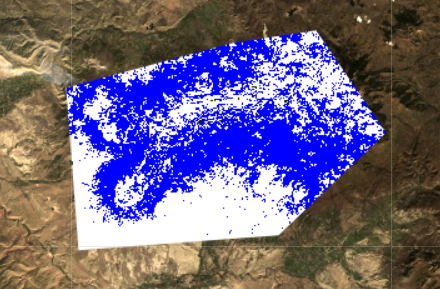

# Google Earth Engine as a Single-Workflow Tool

This example Google Earth Engine (GEE) workflow will demonstrate how to calculate indices based on satellite imagery for use in modelling. We will then discuss extracting these indices to points.

GEE can be a powerful and efficient tool for working with remotely sensed imagery. It can run workflows that otherwise may require multiple platforms. Downloading large imagery datasets, transferring rasters to other platforms, and reformating data can be tedious and slow down processing time. In GEE, many tasks can be done in a single workflow without ever having to download your imagery dataset. Although GEE requires code written in Javascript, don't be intimidated! It's simpler that you may think.


# Calculating Vegetation and Spectral Indices
The processes below are just meant to be examples. Don't be limited by what's presented here. If you can build the indices in your remote sensing software you can build it in GEE.


## Importing Satellite Data

General tutorials for using Javascript in GEE can be found [here](https://developers.google.com/earth-engine/tutorial_js_01) . However, this tutorial will cover a workflow that you can copy-paste into your code editor and explore right away.

GEE allows you to easily search for and download almost any satellite dataset using the Search Bar. Let's pull in a dataset now. Type **"USGS Landsat 8 Surface Reflectance Tier 1"** into the Search Bar, and click on the result.

A window should appear with information on the dataset. It's a good idea to read through it before using a dataset for analysis.  
  

Click the "Import" button on the right side of the window to import the dataset. Notice that the dataset now appears at the top of your scripting window. Click on the variable name (in purple) to rename it using a more specific name. For this example, we will use the name **"LS8_SR"**.  


Note that you have imported the entire Landsat 8 surface reflectance collection, which consists of all imagery collected globally over the lifetime of the satellite. 

We can filter the Landsat dataset via a variety of functions in GEE. Each function can be applied to the same dataset simultaneously by adding each function to the end of the line, separated by a period. First we will limit our image collection to Landsat Path/Row 35/33 for the 2017-2018 calendar year. We can limit by Path/Row using the **.filter(ee.Filter.eq())** function, and we can limit by date with the **.filterDate()** function. In the code below, we limited our data to 2015 to match the NAIP collection year we used in the previous section. The code further limits the dataset to the fall season to capture the unique yellow foliage of aspen in the fall. To capture images with relatively few clouds, the code below keeps only images with less than 20 percent cloud cover.

Copy-paste the script below into the Code Editor, and click the **"Run"** button at the top-right:


```javascript
var LS8_SR1 = ee.ImageCollection(LS8_SR)
  .filterDate('2015-08-01', '2015-11-01') 
  .filter(ee.Filter.eq('WRS_PATH', 35))
  .filter(ee.Filter.eq('WRS_ROW', 33))
  .filterMetadata('CLOUD_COVER', 'less_than', 20);
```

We named our filtered Landsat data to "LS8_SR1" by defining a new variable with **"var"**.

In order to see your Image Collection on the map, you must use the **Map.addLayer()** function and provide visualization parameters. In the below code, we display the image in true-color and apply a stretch. 


```javascript
var visTrueColor = {
bands: ["B4","B3","B2"],
gamma:1,
//Surface reflectance is a unitless ratio scaled to the range 0-10000
max:2741.954698935917, 
min:0, 
Opacity:1
};

Map.addLayer(LS8_SR1, visTrueColor,'LS8_SR1',true)
```

If you'd like to view information on this dataset in the Console, use the **print()** function.

```javascript
print(LS8_SR1,'LS8_SR1')
```
The imported dataset should now be visible in the Console tab. Take time to explore the data structure by clicking on the printed dataset. You will see that we have 3 Landsat scenes in our image collection. While we could choose to work with only one of these scenes, we will instead create a composite image where each pixel is the median value of the entire stack (explained in the upcoming steps). 
   


## Masking Clouds and Reducing Image Collection
In addition to including only scenes with less than 20% cloud cover, we will further reduce clouds by using the 'pixel_qa' band. To apply the same cloud masking process to each image, we will create a cloud filter function in the below script:


```javascript
var maskClouds = function(image){
  var clear = image.select('pixel_qa').bitwiseAnd(2).neq(0);    
  return image.updateMask(clear);   
};
```

We can now apply the function to our Image Collection and reduce the entire collection via the median. This will take the median for each pixel over (see below image from GEE API) . We will name this new image "LS8_SR2" and view it on the map. 

<br>
<center></center>

 
```javascript
var LS8_SR2 = LS8_SR1
  .map(maskClouds)
  .median();
  
Map.addLayer(LS8_SR2, visTrueColor,'LS8_SR2 - masked',false)
print(LS8_SR2,visTrueColor, 'LS8_SR2 - masked')
```

## Defining Indices

We will define our indices in two parts. First, we will define our individual bands (1-7, excluding band 6) as variables. Second, we will perform band math to define new indices. We will use the **.rename** function to rename these bands within the console.


```javascript
var red = LS8_SR2.select('B4').rename("red");
var green= LS8_SR2.select('B3').rename("green");
var blue = LS8_SR2.select('B2').rename("blue");
var nir = LS8_SR2.select('B5').rename("nir");
var swir1 = LS8_SR2.select('B6').rename("swir1");
var swir2 = LS8_SR2.select('B7').rename("swir2");
print(red,'red');
Map.addLayer(red,{},'red',false);
print(green, 'green');
Map.addLayer(green,{},'green',false);

```
Once you run the above code, check out the printed bands within the Console. When we expand the drop-down menus, we see that the bands are now renamed.  


Next, we will define and calculate vegetation and water indices. 

Normalized Difference Vegetation Index (NDVI)
<br>
 The equation for NDVI is:

**NDVI = (nir - red)/(nir + red)**

The code below includes band math that defines an NDVI variable:


```javascript
var ndvi = nir.subtract(red).divide(nir.add(red)).rename('ndvi');
Map.addLayer(ndvi, {},'NDVI',false);
```

Normalized Difference Water Index (NDWI)
<br>
The equation for NDWI is:

**NDWI = (green - nir)/(green + nir)**


```javascript
var ndwi = green.subtract(nir).divide(green.add(nir)).rename('ndwi');
Map.addLayer(ndwi, {},'NDWI',false);
```

Tasselled Cap Brightness (TCB) Index

```javascript
var TCB = LS8_SR2.expression(
  "0.3037 * B2 + 0.2793 * B3 + 0.4743 * B4 + 0.5585 * B5 + 0.5082 * B6 + 0.1863 * B7" , {
  'B2': blue,
  'B3': green,
  'B4': red,
  'B5': nir,
  'B6': swir1,
  'B7': swir1
  }).rename("TCB");

Map.addLayer(TCB, {},'TCB',false);
```
The TCB function example differs from the NDVI and NDWI examples in that we use the **.expression** function. This function requires us to define the band variables below the expression instead of embedding them.

Note that we added these layers to the map, but they don't show up right away. The "false" argument within **Map.addLayer** tells GEE not to display the layer automatically. We can  toggle these layers on or off using the Layers drop-down in the map window.


# Extracting Values to Points

## Importing Point Data

To extract values to points, we must first import our point dataset. In this example, we will use a Google Fusion Table (see **"Creating Fusion Tables and Importing Data into Google Earth Engine"** for more information on creating Fusion Tables). 

We can call the presence-absence fusion table created in the **Ocular Sampling in Google Earth Engine** tutorial via the dataset ID.  
 

Remember: This fusion table represents a binary presence-absence dataset of points collected in our study area using the NLCS dataset, Google Street view images, and false-color imagery. These points indicate areas of aspen stand presence and absence, so we named the variable "PA". Note that your data does not have to be binary.


```javascript
var PA = ee.FeatureCollection('ft:1F4daSPf6KFxX8fM-mWi_ahqsd9Pgsw3FmCryDGID');
Map.addLayer(PA, {}, 'Merged_Presence_Absence');
print(PA, 'Merged_Presence_Absence');

```


<br>
<br>
<br>

Next, we will create an image with each band representing one of our indices. This image will be used to build our model. To create the image, we start with one of our indices (in this case, the NIR band), then add bands until we have included all of our indices.
```javascript
var predictors = nir
                            .addBands(blue)
                            .addBands(green)
                            .addBands(red)
                            .addBands(swir1)
                            .addBands(swir2)
                            .addBands(ndvi)
                            .addBands(TCB)
                            .addBands(ndwi)


print('predictors: ', predictors);
```

Next, we will extract the value of each band at each point in our PA point collection using **.sampleRegions**. Look up the **ee.Image.sampleRegions()** function under the **Docs** tab to familiarize yourself with its arguments.

<br>

 The "collection" argument in **.sampleRegions** specifies the point data with which we will sample our image of indices. The "properties" argument specifies which columns we will carry over to the new feature collection. This will vary based on the column headers of your training point data, so make sure to explore your column headers. Lastly, the "scale" argument indicates the resolution at which you want to sample.


```javascript
var samples = predictors.sampleRegions({
  collection: PA,
  properties: ['presence'],
  scale: 30 });
print(samples,'samples');

```
## Training the Model
Now we want to train our model using the **ee.Classifier.randomForest** function. In the code below, we have a number of parameters specified for each argument. You may want to experiment with these parameter values yourself as all parameters except the number of trees are the GEE default values. For example, increasing the number of trees can increase accuracy, but it will slow down processing time. Over a certain threshold, you may not see much improvement.


```javascript
var trainingclassifier = ee.Classifier.randomForest({
                  numberOfTrees: 10,
                  variablesPerSplit: 0,
                  minLeafPopulation: 1 ,
                  bagFraction: 0.5 ,
                  outOfBagMode: false ,
                  seed:7 }).train({
features: samples,
classProperty: 'presence'});
```
In the above code, the "features" argument of the **.train** function specifies the input feature collection on which to train our model. 

The "classProperties" argument specifies the property on which to train our model. In this case, it is the response variable, which is either a presence or an absence (a binary response). This property is called "presence", the column name indicating presence/absence in our input point data.


## Apply the Model to Imagery

We have created a classifier, but we have not yet applied it. As we would like to apply the classifier only to our area of interest and not the entire Landsat scene, we must first define a region of interest. Create a **Geometry Feature** in Grand Mesa, Colorado. For further information, see **Ocular Sampling in Google Earth Engine** section 1.4. For example:


A geometry import has been added under **Imports**. It is automatically assigned the name "geometry", but let's rename it **"roi."**


Next we will create a variable, called "classified," in which to store our outputs from the Random Forest classifier using the **.classify** function and the classifier we created (trainingclassifier). By adding **.clip**, we can specify a region over which to clip our results. In the code below, we clip our classified image by the feature named "roi".


```javascript
var classified = predictors.classify(trainingclassifier).clip(roi);

print(classified, 'classified');

```
## Viewing the result

We will add the classified layer to the map, and define a color palette.

```javascript
Map.addLayer(classified, {min:0, max:1, palette:['white', 'blue']}, 'classified', false)
```



Finally, export the output as a csv (or an alternate file type, if you prefer) to Google Drive.
```javascript
Export.table.toDrive({
  collection: samples,
  description:'PredictorPoints',
  fileNamePrefix: 'Predictor_Points',
  fileFormat: 'CSV'
});
```

After running all of this, we can go to the **Tasks** tab in the window on the right side of the screen. Normally, it will look like this:


After we extract points and export them as a CSV, the **Tasks** tab will light up in orange; we can view all the tasks listed in this tab. Click on the **"Run"** button next to the task we have just added. You will have the option to choose an output Google Drive folder.

You have now created a CSV or KML with all of your extracted point values!

While created a model, it is important to understand that modeling is an iterative process. It is very unlikely that your first attempt is your most accurate classification. We visualize the results to evaluate and eventually improve the model. In the next section, we demonstrate one method for model improvement--variable selection.

Before exiting your coding window, save your script. We will build on this code in **Assessing Accuracy of Variable Selection for Supervised Classification**.

When you save scripts in your GEE repo, you are using a version of git, which is a version control system that tracks changes in your code. Another useful feature of the GEE repositories is the ability to share scripts or entire repositories and make them read-only or collaboritive. 

# Final complete code for lesson
```javascript
// import Landsat 8 OLI SR data
var LS8_SR1 = ee.ImageCollection(LS8_SR)
  .filterDate('2015-08-01', '2015-11-01') //new date
  .filter(ee.Filter.eq('WRS_PATH', 35))
  .filter(ee.Filter.eq('WRS_ROW', 33))
  .filterMetadata('CLOUD_COVER', 'less_than', 20);

// create a true color visualization parameter 
var visTrueColor = {
bands: ["B4","B3","B2"],
gamma:1,
//Surface reflectance is a unitless ratio scaled to the range 0-10000
max:2741.954698935917, 
min:0, 
Opacity:1
};

Map.addLayer(LS8_SR1, visTrueColor,'LS8_SR1',true)
// print and view the list of images that are available based on our filters
print(LS8_SR1,'LS8_SR1')


// LS8_SR cloud mask function
// The "pixel_qa" band have various flags encoded in different bits.  
// pixel_qa Bit 3: Cloud shadow indicator
// pixel_qa Bit 5: Cloud indicator
// so this will mask out clouds and shadows pixels, caveat: may mask dark areas too that are not necessarily shadows...
var maskClouds = function(image){
  var clear = image.select('pixel_qa').bitwiseAnd(2).neq(0);    
  return image.updateMask(clear);   
};


// apply cloud mask function to the previous filtered image collection and get the median
var LS8_SR2 = LS8_SR1
  .map(maskClouds)
  .median();

Map.addLayer(LS8_SR2, visTrueColor,'LS8_SR2 - masked',false)
print(LS8_SR2,visTrueColor, 'LS8_SR2 - masked')


// define indices
// first define individual bands as variables
var red = LS8_SR2.select('B4').rename("red")
var green= LS8_SR2.select('B3').rename("green")
var blue = LS8_SR2.select('B2').rename("blue")
var nir = LS8_SR2.select('B5').rename("nir")
var swir1 = LS8_SR2.select('B6').rename("swir1")
var swir2 = LS8_SR2.select('B7').rename("swir2")
print(red,'red')
Map.addLayer(red,{},'red',false)
print(green, 'green')
Map.addLayer(green,{},'green',false)

// calculate NDVI index
var ndvi = nir.subtract(red).divide(nir.add(red)).rename('ndvi');
Map.addLayer(ndvi, {},'NDVI',false);

// calculate NDWI index
var ndwi = green.subtract(nir).divide(green.add(nir)).rename('ndwi');
Map.addLayer(ndwi, {},'NDWI',false);

// calculate TCB
var TCB = LS8_SR2.expression(
  "0.3037 * B2 + 0.2793 * B3 + 0.4743 * B4 + 0.5585 * B5 + 0.5082 * B6 + 0.1863 * B7" , {
  'B2': blue,
  'B3': green,
  'B4': red,
  'B5': nir,
  'B6': swir1,
  'B7': swir1
  }).rename("TCB");

Map.addLayer(TCB, {},'TCB',false);

// add Presence-Absence data
var PA = ee.FeatureCollection('ft:1F4daSPf6KFxX8fM-mWi_ahqsd9Pgsw3FmCryDGID')
Map.addLayer(PA, {}, 'Merged_Presence_Absence');
print(PA, 'Merged_Presence_Absence');


var predictors = nir
                            .addBands(blue)
                            .addBands(green)
                            .addBands(red)
                            .addBands(swir1)
                            .addBands(swir2)
                            .addBands(ndvi)
                            .addBands(TCB)
                            .addBands(ndwi)
                      


print('predictors: ', predictors);

// extract the points by our list of predictors
var samples = predictors.sampleRegions({
  collection: PA,
  properties: ['presence'],
  scale: 30 });
print(samples,'samples')

// train our model using random forest
var trainingclassifier = ee.Classifier.randomForest({
                  numberOfTrees: 10,
                  variablesPerSplit: 0,
                  minLeafPopulation: 1 ,
                  bagFraction: 0.5 ,
                  outOfBagMode: false ,
                  seed:7 }).train({
features: samples,
classProperty: 'presence'});

//// create roi

// apply model to imagery using the classifiers 
var classified = predictors.classify(trainingclassifier).clip(roi);

print(classified, 'classified')

// view modeled result
Map.addLayer(classified, {min:0, max:1, palette:['white', 'blue']}, 'classified', false)

// export output as a CSV
Export.table.toDrive({
  collection: samples,
  description:'PredictorPoints',
  fileNamePrefix: 'Predictor_Points',
  fileFormat: 'CSV'
});

```

