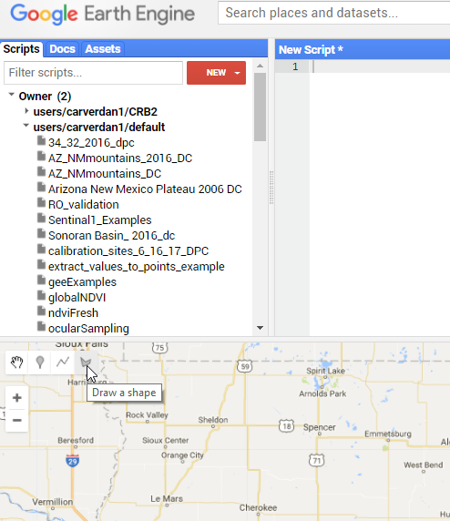
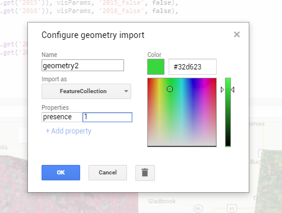
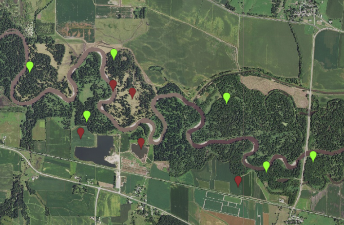
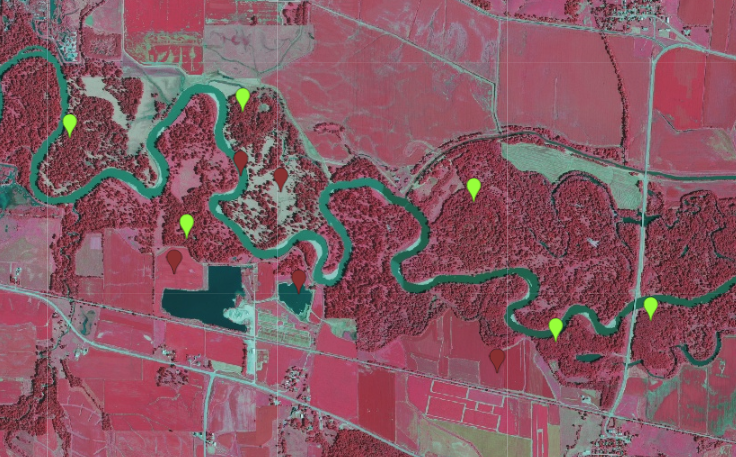

# Google Earth Engine

This resource has changed our methods for working with remotely sensed data. Google Earth Engine is a web based analysis platform that provides access to large libraries of geospatial data. For the most part the available data is raster based. What is nice about the resource it that it takes away the downloading and preprocessing aspects of the working with these datasets. This allows you to move into asking your question and develop methodology very rapidly. GEE does require registration to a google account. You can sign up and read more at this link:[sign up](https://earthengine.google.com/)

## Goal

In this document we will show how to use high resolution NAIP imagery to visually sample for a specific land cover class. This is a method that allows you to add to existing presence and absence locations.

## Setting up Sampling Interface

Depending on your location and time frame, NAIP imagery is collected in 4 bands, blue, green, red, and near infrared. The near infrared band is helpful in distinguishing between different types of vegetation. In this example we will sample deciduous forests in Iowa for 2015. We will load both true color and false color NAIP imagery to allow for the best distinction.

## Define Region of Interest
Creating geometries in earth engine is as simple as pressing the geometry button.
<br>
<br>
<br>



<br>
<br>
<br>
<br>
Click on locations on the map that you want as you region of interest
<br>
<br>
<br>


<br>
<br>
<br>
<br>
Once you complete the geometry feature by placing a point on the starting location, a new feature will appear in your text editor. Leaving this named geometry is fine for now.
<br>
<br>


<br>
<br>
<br>
<br>

## Loading In NAIP Imagery

We started with the plan to sample from the year 2015. However since we used GEE we gave ourselves a few more options. The code below allows you to call in the imagery and filter it for both 2015 and 2016. This is helpfull because NAIP is not collected every year. 

```javascript 
// call in NAIP imagery as an image collection 
var NAIP = ee.ImageCollection("USDA/NAIP/DOQQ")

// filter the data based on date and area for 2015
var naip2015 = NAIP
  .filterBounds(geometry)
  .filterDate("2015-01-01", "2015-12-31")
// filter the data based on date and area for 2016
var naip2016 = NAIP
  .filterBounds(geometry)
  .filterDate("2016-01-01", "2016-12-31")
    
```  

## Adding images to the map

Now that we've loaded the imagery we want to visulize it on the map. NAIP imagery is collected as a series of images. Therefore we need to create a multispectral image by defines what bands we want to use. We do this by setting visulization parameters. Once those are defined we can add the images to the map. 
In this case we're going to add true color and color composites for both 2015 and 2016 because we don't really know when the imagery was captured for your area of interest. 

```javascript 

//define viewing parameters for multi band images 
var visParams = {bands:['N', 'R', 'G']}
var visParams1 = {bands:['R', 'G', 'B']}

// add 2015 imagery to the map with false color and true color composites
Map.addLayer(naip2015,visParams,"2015_false",false )
Map.addLayer(naip2015,visParams1,"2015_true",false )

// add 2016 imagery to the map with false color and true color composites
Map.addLayer(naip2016,visParams,"2016_false",false )
Map.addLayer(naip2016,visParams1,"2016_true",false )

``` 


<br>
<br>
<br>
<br>

## Adding Presence and Absence Locations
Adding in presence and absence layers is a rather straightforward process done by creating a geometry features and placing them on representative locations on the map. 

- Let's select the import geometry box and click create new. 

- A geometry feature should be added below your geometry feature that is functioning as your area of interest.

- Select the gear icon next to the text. 

- A pop up will open. Change the 'import as' type to 'FeatureCollection' and then press the 'add Property button' 

- fill in the boxes with 'presence' | 1 - change the featurecollection name to presence and select a color you enjoy Repeat this process, creating a absence featurecollection where the add property looks as follows 'presence' | 0


<br>
<br>
<br>


<br>
<br>
<br>
<br>


Once the points are created we can sample by selecting the specific feature collection (presence or absence) and use the marker tool to drop points on the imagery.
The sampling methodologies you use will depend on your study. In this example green presence points represent deciduous forest and red point are not deciduous forest. 

<br>
<br>
<br>

<br>
<br>
<br>

Above is a true color image 
Below is a false color image


<br>
<br>
<br>

## Exporting points

Once you've completed sampling you can export your feature collections. This is another section of code. When you run the code the Taskbar in the upper right hand side of the console will light up. The task needs to be run to actually execute the export. 
<br>
```javascript
//export presence points
Export.table.toDrive({
  collection: presence,
  description:'presencePointsForForest',
  fileFormat: 'csv'
});
// export the absence points
Export.table.toDrive({
  collection: absence,
  description:'absencePointsForForest',
  fileFormat: 'csv'
});
```
<br>
Moving material in and out of GEE can be a real challange. While this does produce a csv it is still take some time and effort to make match the format you might be expecting. The best advice I have to to work with the data in GEE for as long as you can before exporting. 
