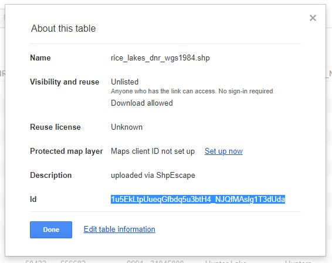

# Creating a Fusion Table

In this excercise, we will learn how to import a data file into Google Earth Engine (GEE) Code Editor. This is essential if you want to use point or location data in GEE.  

## Shapefile to Fusion Table
First, it is important to note that the projection that GEE uses is **WGS 1984 Web Auxiliary Sphere**. Thus, shapefiles must first be projected to **WGS 1984** before importing into GEE.

A Fusion Table is Google's version of a spreadsheet, or data organized as a table. GEE uses Fusion Tables, so data must be converted to a Fusion Table before it is usable. A convenient way to convert from a shapefile to a Fusion Table is by using the website **"Shape Escape"**: [shpescape.com](shpescape.com). In the steps below, we walk through this process.

1. Copy all associated files (".shp" ".shx" ".dbf" and ".prj") to a new folder on your computer, and zip the folder.
2. Go to shpescape.com. Choose the "shp 2 fusion tables" option.  
3. Select Continue.  
4. Upoad your zipped folder, and submit.  
5. Click the link to access your Fusion Table.  
6. Once you have opened your table, click "Share" to choose sharing options or add access for specific people.  

## CSV or KML to Fusion Table
The following steps walk through how to convert CSV or KML data to a Fusion Table.  
1. Go to [this Link](https://support.google.com/fusiontables/answer/2571232?hl=en). Here, you can create a Fusion Table through Google Drive.  
2. Select "Create Fusion Table".  
3. Select a .kml or .csv file type.  
4. Click "Share" to choose sharing options or add access for specific people.  


## Importing a Fusion Table into Google Earth Engine
Once you have created your fusion table, open it. Fusion Tables are stored on your Google Drive, and can be opened by right-clicking the file in your drive. Then, you can select Open with > Fusion Tables.

When you have pulled up your table, click the File tab, then the **About this Table** option. A new window will open which includes information such as the table ID. This is a specific ID that you can share with people or link in a GEE script in order to call upon this specific table. Copy this ID (highlight and right click to copy.)  


Next, go to your GEE script. Once here, you can paste in the table ID in order to reference this table.

The syntax for importing a table using a Fusion Table ID is as follows:
```javascript
var fc = ee.FeatureCollection('ft:19YknBH-2mw2tl2ZGN6zDYpFaDx_10LP0lEl5r7Oh');
```
Here, you may paste in you table ID, and rename your variable.

So far, we have only created the variable that stores the data. If you want to add the data to the map, you can use the **Map.addLayer** function.
```javascript
Map.addLayer(fc,{},'import')
print(fc)
```
The first argument should be the name of the variable you created previously. In the third argument (in quatations), you can name the layer as you'd like it to appear under the Layers tab. The fourth argument specifies if you want the layer to automatically appear. "false" means that the layer will only appear on the map when toggled on, under the Layers tab, which appears after you have run the **Map.addLayer** function in the right corner of the map window. Specifying "true" means that the layer will initially appear automatically. Click **"Run"** to run the script:


Congratulations! You have now created a Fusion Table and imported your data into GEE.
